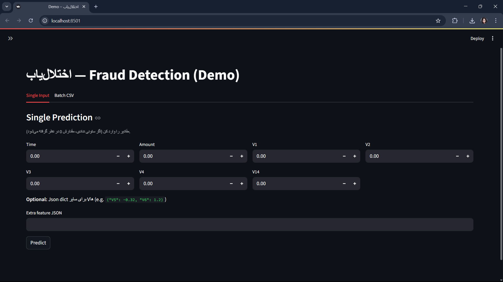
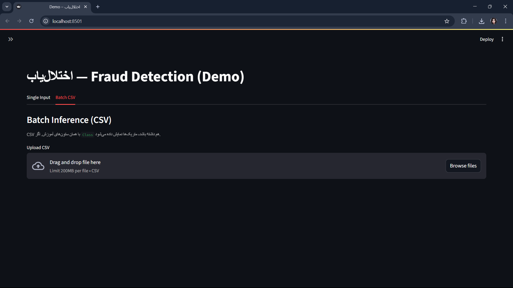

# اختلال‌یاب — Fraud Detection (Minimal, Clean, Ready to Showcase)

پروژه‌ای مینیمال اما استاندارد برای **تشخیص تقلب در تراکنش‌ها** مبتنی بر داده‌ی معروف `creditcard.csv` (ویژگی‌های V1..V28). خروجی‌ها شامل **مدل آموزش‌دیده**، **گزارش متریک‌ها**، **نمودارهای ROC/PR/CM** و **دموی Streamlit** هستند. هدف: **تمام‌شدن تمیز در چند ساعت** و مناسب برای نمونه‌کار.

---

## ویژگی‌ها (Highlights)

* اسکریپت یک‌مرحله‌ای آموزش و ارزیابی: `main.py`
* ذخیره‌ی آرتیفکت‌ها: `models/fraud_pipeline.joblib` و `reports/metrics.json`
* ترسیم و ذخیره‌ی **ROC**، **Precision–Recall** و **Confusion Matrix**
* انتخاب **آستانه بهینه** (Best Threshold by F1) و ذخیره در `metrics.json`
* **Streamlit demo** برای پیش‌بینی تک‌نمونه و **Batch CSV** با دانلود خروجی
* ساختار تمیز پوشه‌ها و `.gitignore` آماده

---

## ساختار پروژه

```
fraud_detector/
├─ data/
│  ├─ raw/                 # creditcard.csv (ورودی خام)
│  └─ processed/           # (اختیاری)
├─ models/
│  └─ fraud_pipeline.joblib
├─ reports/
│  ├─ metrics.json
│  └─ figures/
│     ├─ roc.png
│     ├─ pr.png
│     └─ cm.png
├─ streamlit_app/
│  └─ app.py               # دمو
├─ src/
│  ├─ config/
│  ├─ data_loader/
│  ├─ evaluator/
│  ├─ model_builder/
│  ├─ trainer/
│  └─ utils/
├─ .gitignore
├─ requirements.txt
└─ main.py
```

---

## نصب پیش‌نیازها (Requirements)

```bash
pip install -r requirements.txt
```

> Python 3.10+ پیشنهاد می‌شود.

---

## داده

* فایل `creditcard.csv` را در مسیر زیر قرار دهید:

  ```
  data/raw/creditcard.csv
  ```
* ستون هدف باید `Class` باشد (۰ = نرمال، ۱ = تقلب).

---

## اجرای سریع (Quickstart)

### PowerShell (Windows)

```powershell
# 1) Train + save
python .\main.py --data data\raw\creditcard.csv --model-out models\fraud_pipeline.joblib --metrics-out reports\metrics.json

# 2) Curves + best threshold
python -m src.evaluator.evaluator --model models\fraud_pipeline.joblib --data data\raw\creditcard.csv --target Class --outdir reports\figures --metrics reports\metrics.json

# 3) Streamlit demo
streamlit run .\streamlit_app\app.py
```

### Bash (macOS/Linux)

```bash
# 1) Train + save
python main.py --data data/raw/creditcard.csv --model-out models/fraud_pipeline.joblib --metrics-out reports/metrics.json

# 2) Curves + best threshold
python -m src.evaluator.evaluator --model models/fraud_pipeline.joblib --data data/raw/creditcard.csv --target Class --outdir reports/figures --metrics reports/metrics.json

# 3) Streamlit demo
streamlit run streamlit_app/app.py
```

---

## خروجی‌ها (Artifacts)

* **مدل:** `models/fraud_pipeline.joblib`

* **متریک‌ها:** `reports/metrics.json` شامل:

  ```json
  {
    "roc_auc": 0.9657,
    "pr_auc": 0.6719,
    "report": { "val": {"precision": "..."}, "test": {"precision": "..."} },
    "extra": {
      "phase": "test",
      "best_threshold": 0.37,
      "assets": {"roc": "reports/figures/roc.png", "pr": "reports/figures/pr.png", "cm": "reports/figures/cm.png"}
    }
  }
  ```

  > مقادیر نمونه‌اند؛ اعداد واقعی پس از اجرا جایگزین می‌شوند.

* **نمودارها:**

  * 
  * 
  * 

---

## Streamlit Demo

* صفحه سایدبار شامل **Threshold** (قابل تغییر)؛ به‌صورت پیش‌فرض از `metrics.json` خوانده می‌شود.
* تب **Single Input**: ورودی چند ویژگی کلیدی + امکان وارد کردن JSON برای سایر Vها.
* تب **Batch CSV**: آپلود فایل CSV، نمایش پیش‌نمایش، محاسبه‌ی probability و کلاس نهایی، دانلود خروجی.
* در صورت وجود ستون `Class`، متریک‌ها و **Confusion Matrix** نمایش داده می‌شود.

---

## راهنمای استفاده از دمو (با اسکرین‌شات)

1. از ریشهٔ پروژه اجرا کنید:

   ```bash
   streamlit run streamlit_app/app.py
   ```

2. تب **Single Input**:

   * مقادیر چند ویژگی را وارد کنید و روی **Predict** بزنید.
   * کلاس نهایی با توجه به **Threshold** سایدبار تعیین می‌شود.

   **Screenshot:**
   

3. تب **Batch CSV**:

   * فایل `CSV` را آپلود کنید (اگر ستون `Class` داشته باشد متریک‌ها هم نمایش داده می‌شود).
   * نتایج را بررسی کنید و با **Download** خروجی را ذخیره کنید.

   **Screenshot:**
   

> مسیرهای تصاویر بالا را طبق محل ذخیره‌سازی خودتان اصلاح کنید. پیشنهاد مسیر: `reports/screens/`.

---

## نکات فنی

* در ویندوز برای اجرای دستورات چندخطی از بک‌تیک PowerShell (`) استفاده کنید؛ بک‌اسلش `\` مخصوص Bash است.
* اجرای Streamlit را از **ریشه پروژه** انجام دهید تا مسیرهای نسبی (`models/`, `reports/`) درست تشخیص داده شوند.
* اگر مدل پیدا نشد، از داخل `streamlit_app/app.py` می‌توانید مسیر مدل و متریک‌ها را ویرایش کنید یا assert را با `st.stop()` جایگزین کنید.

---

## سفارشی‌سازی سریع

* آستانه‌ی تصمیم‌گیری: مقدار `best_threshold` در `reports/metrics.json`.
* اگر خواستید معیار دیگری برای آستانه استفاده کنید (مثلاً F0.5 برای تأکید روی Precision)، پارامتر `--beta` را در اسکریپت evaluator تغییر دهید.

---

## لایسنس / نسبت‌دادن (Attribution)

* دیتاست کارت‌های اعتباری (V1..V28) نسخه‌ی عمومی Kaggle/CCFD.
* کدهای این مخزن صرفاً برای اهداف آموزشی و نمونه‌کار منتشر شده‌اند.

---

## تماس

برای هر مشکل یا پیشنهاد، Issue بزنید یا PR ارسال کنید.
